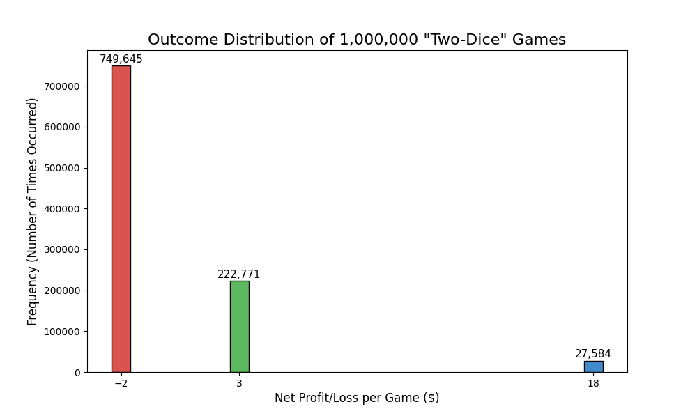

# Monte Carlo & Expected Value Analyzer

This is a command-line application, written in Python, designed to analyze the profitability of a simple two-dice casino game.

This project was built to demonstrate my core skills in algorithmic thinking, quantitative analysis, and data visualization. It models the game in three ways:

1.  **Monte Carlo Simulation:** A simulator (`simulate()`) runs the game 1,000,000 times to find the empirical, real-world profit/loss.
2.  **Mathematical Calculation:** An expected value calculator (`calculate_ev()`) uses pure probability to determine the precise mathematical "Expected Value" (EV) of a single game.
3.  **Data Visualization:** A plotter (`create_histogram()`) uses `matplotlib` to generate a bar chart of the simulation's outcomes, visualizing the frequency of each win/loss scenario.

---

## Project Output

Running `python main.py` will run the simulation and the EV calculation. It will also generate the following image (`game_outcome_distribution.png`):

---

## Tech Stack

* **Python 3.10.11**
* **Matplotlib**
* **NumPy**

## How to Run

1.  Clone this repository.
2.  Install required libraries: `pip install -r requirements.txt`
3.  Run the file: `python main.py`
